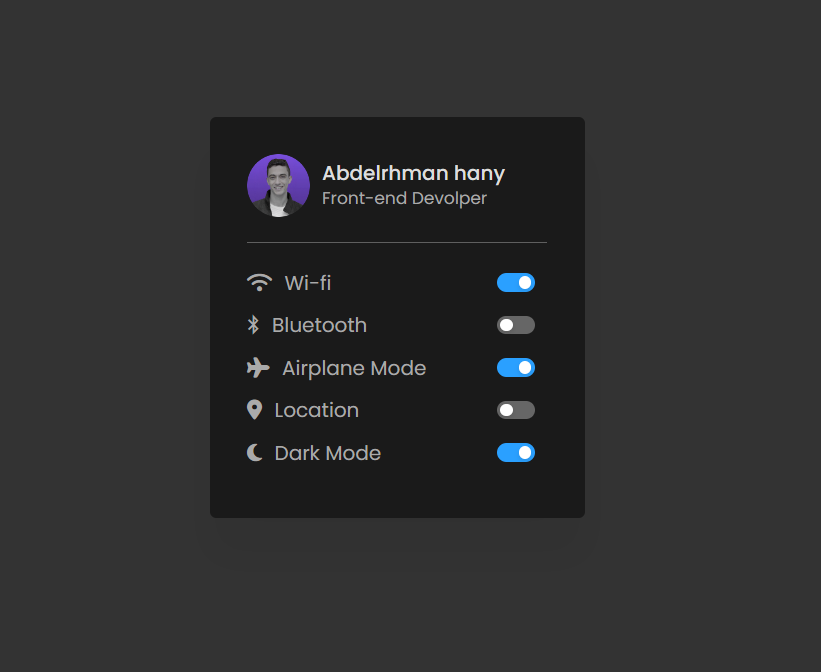

# Menu with Custom Checkbox Toggle

This project features a customizable menu with toggle switches using checkboxes. Built with HTML, CSS, and JavaScript, the menu allows users to enable or disable various settings such as Wi-Fi, Bluetooth, Airplane Mode, and more. The design includes custom checkboxes and a dark mode toggle.

## Features

- Custom checkboxes to toggle settings like Wi-Fi, Bluetooth, Airplane Mode, and Location.
- A dark mode toggle switch to switch between light and dark themes.
- Icons representing each setting for a more intuitive user interface.
- Real-time updates when toggling settings.

## How It Works

- The HTML structure provides the layout of the menu and toggle switches.
- CSS is used to style the menu, checkboxes, and icons, ensuring a clean and modern look.
- JavaScript manages the toggle functionality, including the dark mode feature that adds or removes a class based on the checkbox state.

## Screenshot

## Technologies Used

- **HTML**: For the structure of the menu and checkboxes.
- **CSS**: For styling the menu, checkboxes, and icons.
- **JavaScript**: For handling the toggle functionality and dark mode feature.
